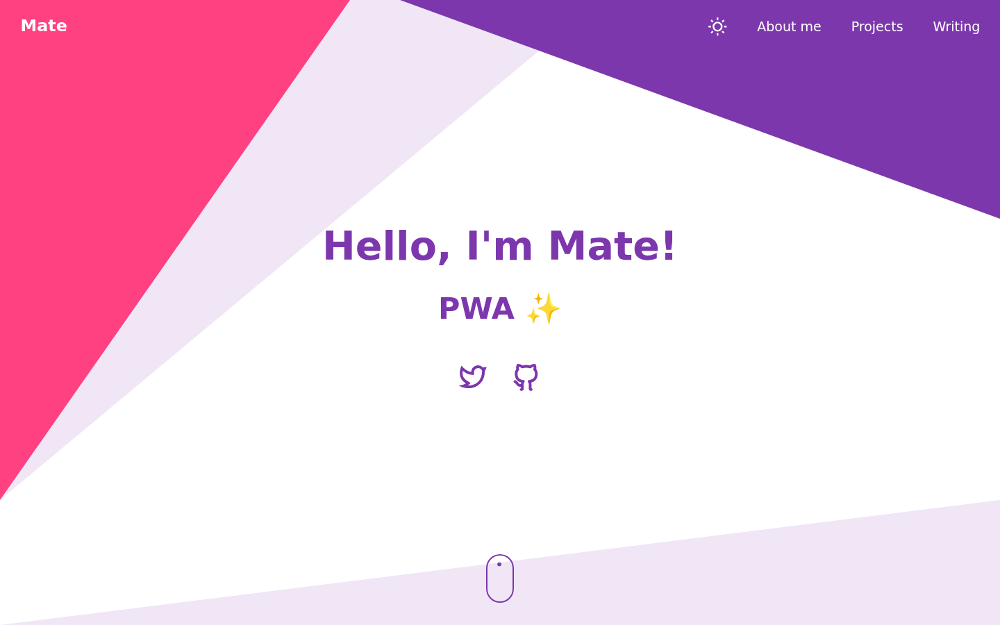
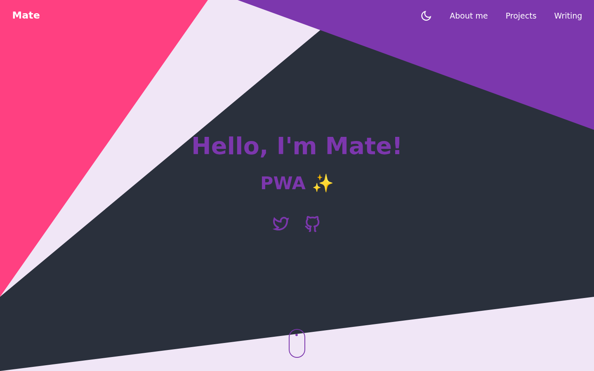
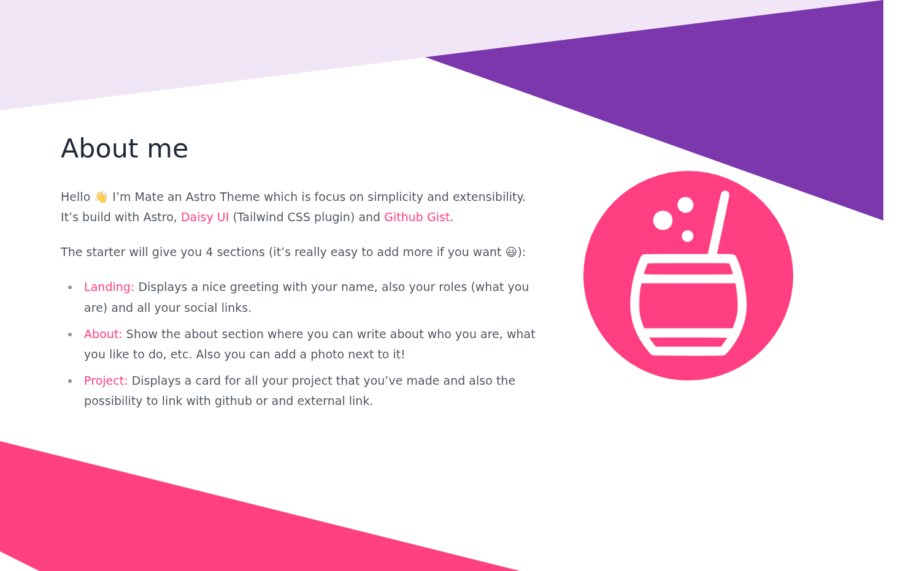
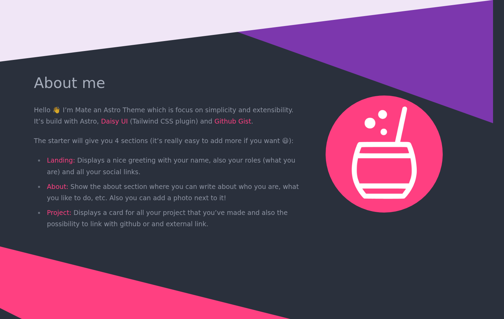
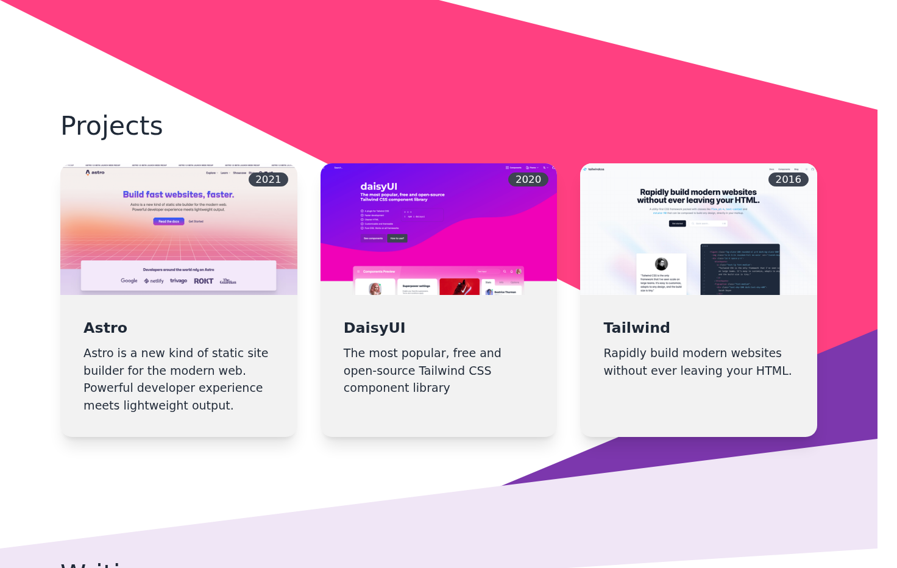
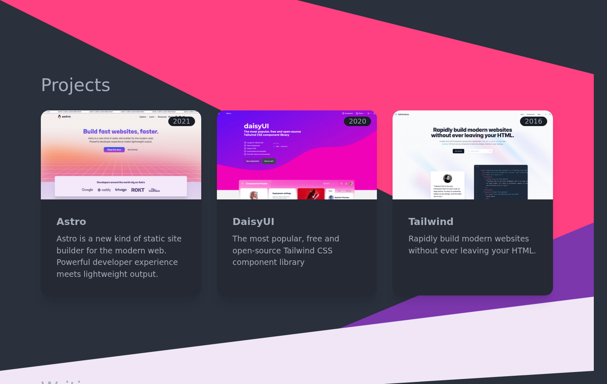
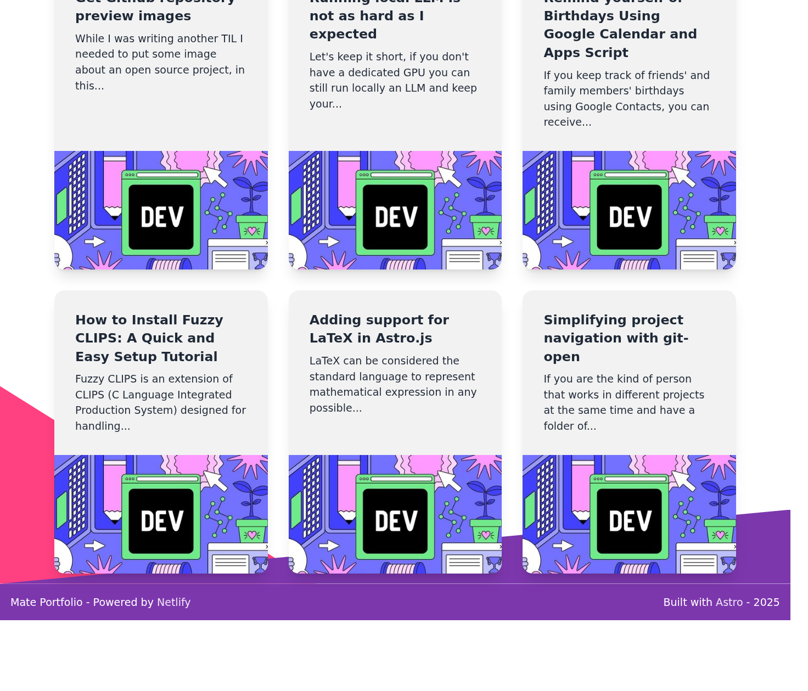
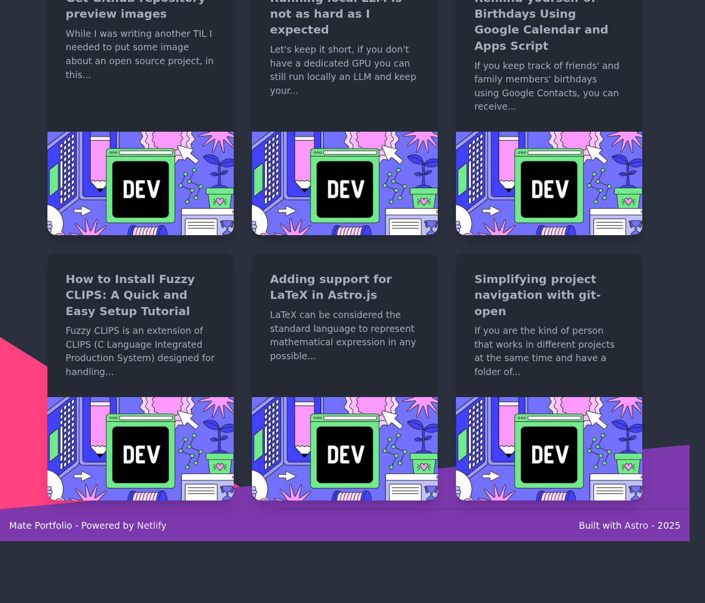

# Astro Theme: Mate

> An accessible and fast portfolio starter for Astro, for Developers and Tech Writers.

## [Demo](https://astro-mate.netlify.app/)

## Screenshots 📸

Captured from the [live demo](https://astro-mate.netlify.app/) with [shot-scraper](https://github.com/simonw/shot-scraper). Light and dark run as parallel CI jobs via [`shots-light.yml`](shots-light.yml) / [`shots-dark.yml`](shots-dark.yml) (workflow: [`.github/workflows/screenshots.yml`](.github/workflows/screenshots.yml)). Home, About, Projects, and Writing (DaisyUI `data-theme`).

| Light | Dark |
| ----- | ---- |
|  |  |
|  |  |
|  |  |
|  |  |

## Migrating from [gatsby-starter-mate](https://github.com/EmaSuriano/gatsby-starter-mate)

Astro Mate is the successor to the Gatsby starter. Same portfolio shape (Landing, About, Projects, Writing), lighter stack.

| Gatsby Mate | Astro Mate |
| --- | --- |
| Contentful CMS | GitHub Gist JSON (site content) |
| Medium posts | Dev.to API |
| Rebass | DaisyUI + Tailwind |
| Font Awesome | Iconify |
| `gatsby new` | Clone this repo / use as Astro template |

### Contentful to Gist

1. Export about / projects / socials from Contentful (or copy from the live site).
2. Create a public Gist with JSON matching `src/types.ts` (see the demo Gist used by the Netlify site).
3. Point `CONFIG_URL` in `src/pages/index.astro` at that Gist raw URL.
4. Redeploy. No Contentful space or API keys required.

### Medium to Dev.to

1. Publish (or cross-post) writing on Dev.to.
2. Set `devToUser` in the Gist config JSON.
3. Astro Mate fetches posts from the Dev.to API at build time.

After you are happy with Astro Mate, archive gatsby-starter-mate and point its README here.

## Project Overview

- Astro with TypeScript
- Icons from Iconify
- DaisyUI + Tailwind
- GitHub Gist as CMS
- Dev.to writing feed
- Schema validation with Zod

## Commands

| Command | Action |
| --- | --- |
| `yarn` | Install dependencies |
| `yarn dev` | Dev server |
| `yarn build` | Production build to `./dist/` |
| `yarn preview` | Preview the production build |

## Learn more

[Astro docs](https://docs.astro.build) · [DaisyUI](https://daisyui.com/) · [Discord](https://astro.build/chat)
